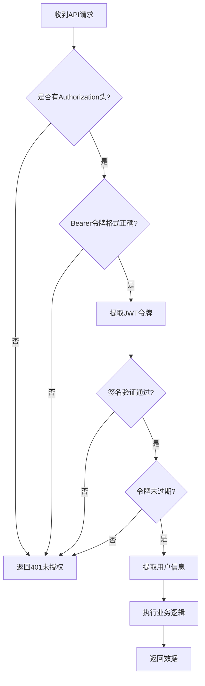

# JWT 完整学习指南

## 🎯 学习目标

通过我们创建的前后端项目，全面理解JWT的工作原理、实现方式和安全机制。

## 📚 核心概念

### 什么是JWT？

JWT（JSON Web Token）是一种开放标准（RFC 7519），用于在各方之间安全地传输信息。它是一个紧凑的、URL安全的令牌。

### JWT的三个组成部分

```
eyJhbGciOiJIUzI1NiIsInR5cCI6IkpXVCJ9.eyJuYW1lIjoiYWRtaW4iLCJ1c2VySWQiOiIxIn0.signature
    ↑                                    ↑                              ↑
  Header                              Payload                       Signature
```

## 🔍 项目实战分析

### 1. 后端JWT实现 (.NET Core)

#### 关键配置点
```csharp
// 1. JWT密钥配置 - 必须足够长（至少256位）
var jwtKey = "SuperSecureJwtKeyForDemoApplication2024WithAtLeast256BitsLength!@#$%^&*()";

// 2. 认证服务配置
builder.Services.AddAuthentication(JwtBearerDefaults.AuthenticationScheme)
.AddJwtBearer(options => {
    options.TokenValidationParameters = new TokenValidationParameters
    {
        ValidateIssuerSigningKey = true,  // 验证签名密钥
        IssuerSigningKey = new SymmetricSecurityKey(key),
        ValidateIssuer = false,           // 不验证发行者
        ValidateAudience = false          // 不验证受众
    };
});
```

#### JWT生成过程
```csharp
private string GenerateJwtToken(string username)
{
    var tokenDescriptor = new SecurityTokenDescriptor
    {
        // 用户声明信息
        Subject = new ClaimsIdentity(new[]
        {
            new Claim(ClaimTypes.Name, username),
            new Claim("userId", "1"),
            new Claim("role", "admin")
        }),
        // 过期时间设置
        Expires = DateTime.UtcNow.AddHours(1),
        // 签名凭据
        SigningCredentials = new SigningCredentials(
            new SymmetricSecurityKey(key), 
            SecurityAlgorithms.HmacSha256Signature)
    };
    
    var token = tokenHandler.CreateToken(tokenDescriptor);
    return tokenHandler.WriteToken(token);
}
```

### 2. 前端JWT处理 (JavaScript)

#### 令牌存储策略
```javascript
// 登录成功后存储
localStorage.setItem('jwt_token', token);

// 应用启动时检查
this.token = localStorage.getItem('jwt_token');

// 退出时清除
localStorage.removeItem('jwt_token');
```

#### API请求认证
```javascript
// 在请求头中携带JWT令牌
headers: {
    'Authorization': `Bearer ${this.token}`,
    'Content-Type': 'application/json',
}
```

#### 客户端令牌解码
```javascript
decodeToken() {
    const parts = this.token.split('.');
    const header = JSON.parse(atob(parts[0]));    // Base64解码Header
    const payload = JSON.parse(atob(parts[1]));   // Base64解码Payload
    // parts[2] 是签名，无法在客户端验证
}
```

## 🔐 安全机制深度解析

### 1. 签名验证机制

```
原始数据: Header.Payload
密钥: SuperSecureJwtKeyForDemo...
算法: HMAC-SHA256

服务器计算: HMACSHA256(Header.Payload, 密钥) = 期望签名
实际签名: JWT中的第三部分
验证: 期望签名 === 实际签名
```

### 2. 防篡改原理

- **任何修改都会导致签名不匹配**
- **攻击者无法在不知道密钥的情况下生成有效签名**
- **即使修改一个字符，整个令牌都会失效**

### 3. 时效性控制

```javascript
// 令牌中的过期时间
"exp": 1703123456  // Unix时间戳

// 服务器验证
if (DateTime.UtcNow > tokenExpiry) {
    return Unauthorized();
}
```

## 🚀 实际工作流程

### 完整认证流程

1. **用户登录** → 输入 admin/password
2. **凭据验证** → 后端检查用户名密码
3. **JWT生成** → 创建包含用户信息的令牌
4. **令牌返回** → 前端接收并存储令牌
5. **API访问** → 请求头携带Bearer令牌
6. **令牌验证** → 后端验证签名和过期时间
7. **数据返回** → 验证通过后返回受保护数据

### 关键验证点



## 💡 最佳实践

### 1. 安全配置
- ✅ 使用足够长的密钥（至少256位）
- ✅ 设置合理的过期时间（1小时）
- ✅ 在生产环境使用HTTPS
- ✅ 实现令牌刷新机制

### 2. 错误处理
```javascript
// 前端统一处理401错误
if (response.status === 401) {
    this.logout();  // 清除本地令牌
    // 跳转到登录页面
}
```

### 3. CORS配置
```csharp
// 后端允许跨域请求
builder.Services.AddCors(options =>
{
    options.AddPolicy("AllowAll", builder =>
    {
        builder.AllowAnyOrigin()
               .AllowAnyMethod()
               .AllowAnyHeader();
    });
});
```

## 🔧 调试技巧

### 1. 查看令牌内容
- 使用我们项目中的"解码令牌"功能
- 在线工具：jwt.io
- 浏览器开发者工具查看localStorage

### 2. 网络请求调试
```javascript
// 在浏览器控制台查看请求头
console.log('Request Headers:', {
    'Authorization': `Bearer ${this.token}`
});
```

### 3. 后端日志
```csharp
// 在控制器中添加日志
_logger.LogInformation($"User {username} logged in successfully");
```

## 🎓 学习检验

### 理解检查点

1. **能否解释JWT的三个部分？**
   - Header：算法和类型
   - Payload：用户信息和声明
   - Signature：防篡改签名

2. **能否说出JWT的安全机制？**
   - 签名验证防篡改
   - 过期时间控制有效期
   - 无状态设计

3. **能否实现基本的JWT认证？**
   - 后端生成和验证JWT
   - 前端存储和使用JWT
   - 处理认证失败情况

### 实践练习

1. **修改过期时间**：将令牌过期时间改为30分钟
2. **添加新声明**：在JWT中添加用户邮箱信息
3. **实现刷新机制**：添加refresh token功能
4. **角色权限控制**：基于JWT中的role实现权限控制

## 📖 扩展阅读

- [RFC 7519 - JSON Web Token](https://tools.ietf.org/html/rfc7519)
- [JWT.io - JWT调试工具](https://jwt.io/)
- [OWASP JWT安全指南](https://cheatsheetseries.owasp.org/cheatsheets/JSON_Web_Token_for_Java_Cheat_Sheet.html)

通过我们的实际项目，您已经掌握了JWT的核心概念和实现方式。继续实践和探索，您将能够在实际项目中熟练运用JWT技术！